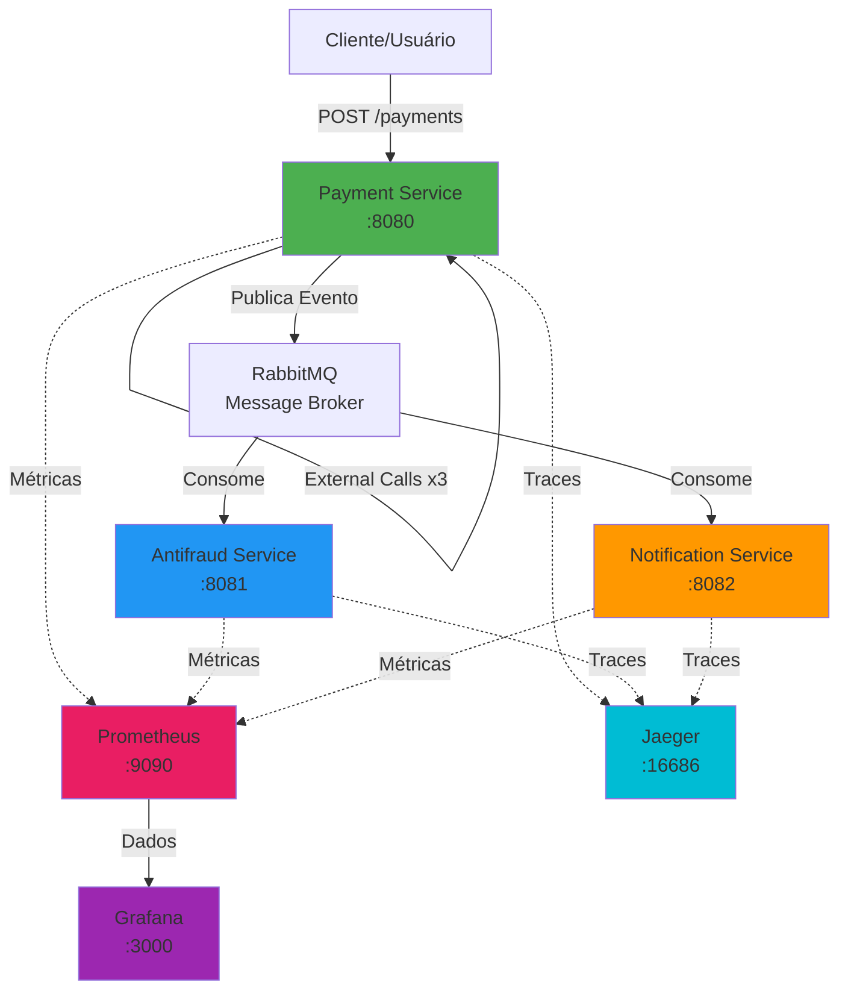
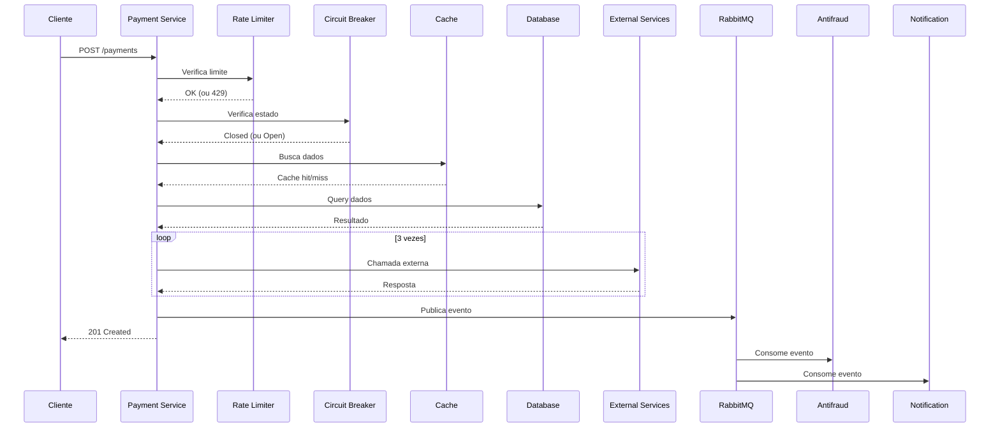
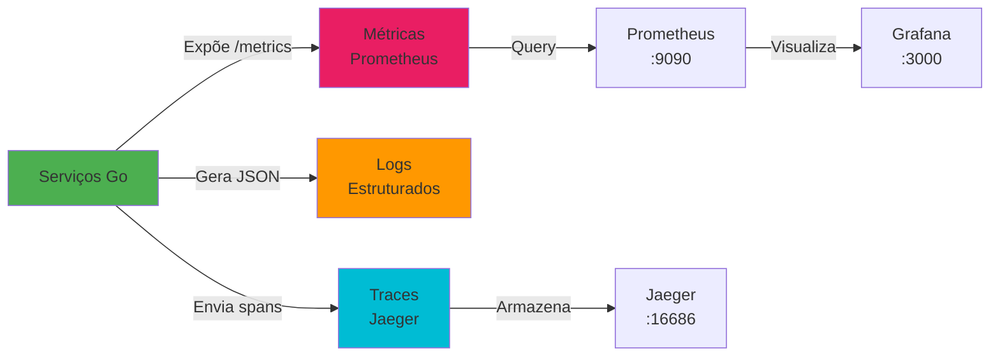

# Arquitetura do Sistema

[← Voltar ao README](../README.md)

---

## Diagrama de Arquitetura

## Fluxo de Processamento de Pagamento

## Fluxo de Observabilidade

## Observabilidade

- Todos os serviços expõem métricas para Prometheus
- Todos os serviços enviam traces para Jaeger
- Todos os serviços geram logs estruturados

---

[← Voltar ao README](../README.md)
