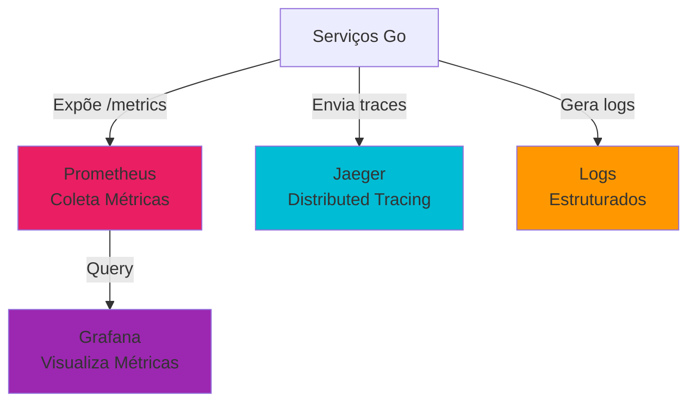

# Guia Completo: Analisando Observabilidade

[← Voltar ao README](../README.md)

---

### Visão Geral das Ferramentas



---

### 1. Analisando no Prometheus

**Acesse:** http://localhost:9090

#### 1.1 Conceitos Básicos do Prometheus

**O que é Prometheus?**
- Sistema de monitoramento e alerta
- Coleta métricas de serviços
- Armazena séries temporais
- Permite queries (PromQL)

**Tipos de Métricas:**
- **Counter:** Só aumenta (ex: total de requisições)
- **Gauge:** Valor atual (ex: CPU usage)
- **Histogram:** Distribuição de valores (ex: latência)

#### 1.2 Queries Essenciais

**1.2.1 Taxa de Requisições (Rate)**

```promql
rate(http_requests_total[5m])
```

**O que faz:**
- Calcula taxa de requisições por segundo
- `[5m]` = janela de 5 minutos
- `rate()` = calcula taxa de mudança

**Como usar:**
1. Cole a query na aba "Graph"
2. Clique em "Execute"
3. Veja o gráfico

**O que observar:**
- Linha mostra requisições por segundo
- Picos indicam aumento de tráfego

**1.2.2 Taxa de Erros**

```promql
rate(http_requests_total{status=~"5.."}[5m]) / rate(http_requests_total[5m])
```

**O que faz:**
- Calcula porcentagem de erros
- `status=~"5.."` = status 5xx (erros)
- Divide erros pelo total

**O que observar:**
- Valor entre 0 e 1 (0% a 100%)
- 0 = sem erros
- > 0.01 (1%) = problema

**1.2.3 Latência p50 (Mediana)**

```promql
histogram_quantile(0.50, rate(http_request_duration_seconds_bucket[5m]))
```

**O que faz:**
- Calcula percentil 50 (mediana)
- 50% das requisições são mais rápidas que este valor

**O que observar:**
- Valor em segundos
- < 0.1s = bom
- > 0.5s = problema

**1.2.4 Latência p90**

```promql
histogram_quantile(0.90, rate(http_request_duration_seconds_bucket[5m]))
```

**O que faz:**
- Calcula percentil 90
- 90% das requisições são mais rápidas

**O que observar:**
- Deve ser maior que p50
- < 0.2s = bom
- > 1s = problema

**1.2.5 Latência p95**

```promql
histogram_quantile(0.95, rate(http_request_duration_seconds_bucket[5m]))
```

**O que faz:**
- Calcula percentil 95
- 95% das requisições são mais rápidas

**O que observar:**
- Deve ser maior que p90
- < 0.3s = bom
- > 1.5s = problema

**1.2.6 Latência p99 (Cauda - Mais Importante!)**

```promql
histogram_quantile(0.99, rate(http_request_duration_seconds_bucket[5m]))
```

**O que faz:**
- Calcula percentil 99
- 99% das requisições são mais rápidas
- **Este é o mais importante!** Mostra a "cauda" (pior caso)

**O que observar:**
- Deve ser maior que p95
- < 0.5s = bom
- > 2s = problema crítico
- **Usuário sente a cauda, não a média!**

**1.2.7 Comparar p50 vs p99**

Execute ambas as queries lado a lado:

```promql
# p50
histogram_quantile(0.50, rate(http_request_duration_seconds_bucket[5m]))

# p99
histogram_quantile(0.99, rate(http_request_duration_seconds_bucket[5m]))
```

**O que observar:**
- Se p99 >> p50 (muito maior), há cauda longa
- Isso indica que algumas requisições são muito lentas
- **Problema:** Poucas requisições lentas afetam experiência do usuário

**1.2.8 CPU Utilization**

```promql
cpu_utilization_percent
```

**O que faz:**
- Mostra uso de CPU (0-100%)

**O que observar:**
- < 70% = normal
- 70-90% = atenção
- > 90% = problema (saturação)

**1.2.9 Queue Depth (Saturação)**

```promql
message_queue_depth
```

**O que faz:**
- Mostra quantas mensagens estão na fila

**O que observar:**
- 0 = fila vazia (bom)
- < 100 = normal
- > 1000 = problema (fila crescendo)

**1.2.10 Rate Limiting (Backpressure)**

```promql
rate(rate_limit_rejected_total[5m])
```

**O que faz:**
- Mostra quantas requisições foram rejeitadas por rate limiting

**O que observar:**
- 0 = sem rejeições (bom)
- > 0 = sistema está rejeitando requisições
- **Isso é bom!** Sistema está se protegendo

---

### 2. Analisando no Grafana

**Acesse:** http://localhost:3000 (admin/admin)

#### 2.1 Conceitos Básicos do Grafana

**O que é Grafana?**
- Plataforma de visualização de métricas
- Conecta com Prometheus
- Cria dashboards bonitos
- Permite alertas

#### 2.2 Acessando Dashboards

**Passo 2.2.1: Login**

1. Acesse: http://localhost:3000
2. Login: `admin`
3. Senha: `admin`
4. Clique em "Log in"

**Passo 2.2.2: Navegar para Dashboards**

1. No menu lateral, clique em "Dashboards" (ícone de quadrado)
2. Clique em "Browse"
3. Você verá lista de dashboards

#### 2.3 Dashboard: RED Metrics

**O que é RED?**
- **R**ate: Taxa de requisições
- **E**rrors: Taxa de erros
- **D**uration: Latência

**Abrir Dashboard:**

1. Procure por "RED Metrics - Payment Service"
2. Clique para abrir

**Painéis do Dashboard:**

**Painel 1: Rate - Requests per Second**

**O que mostra:**
- Gráfico de linha mostrando requisições por segundo ao longo do tempo

**Como analisar:**
1. **Olhe o eixo Y (vertical):** Valores em "reqps" (requests per second)
2. **Olhe o eixo X (horizontal):** Tempo
3. **Olhe a linha:**
   - Linha subindo = mais requisições
   - Linha descendo = menos requisições
   - Linha plana = tráfego constante

**O que procurar:**
- **Picos:** Aumento súbito de tráfego
- **Vales:** Quedas de tráfego
- **Tendência:** Tráfego aumentando ou diminuindo?

**Exemplo de análise:**
- "Vejo que às 14:00 houve um pico de 50 req/s"
- "Depois caiu para 10 req/s"
- "Isso pode indicar um evento específico"

**Painel 2: Errors - Error Rate**

**O que mostra:**
- Gráfico mostrando porcentagem de erros

**Como analisar:**
1. **Olhe o eixo Y:** Valores em porcentagem (0% a 100%)
2. **Olhe a linha:**
   - Linha em 0% = sem erros (verde)
   - Linha > 0% = há erros (vermelho)

**O que procurar:**
- **Qualquer valor > 0%:** Há erros!
- **Valores > 1%:** Problema sério
- **Picos de erro:** Quando ocorreram?

**Exemplo de análise:**
- "Vejo que às 14:05 a taxa de erro subiu para 5%"
- "Isso coincide com o pico de tráfego"
- "Pode ser que o sistema não aguentou a carga"

**Painel 3: Duration - Latency Percentiles**

**O que mostra:**
- Gráfico com 4 linhas: p50, p90, p95, p99
- Cada linha mostra um percentil de latência

**Como analisar:**
1. **Olhe o eixo Y:** Valores em segundos
2. **Olhe as 4 linhas:**
   - **p50 (azul):** Mediana (50% das requisições)
   - **p90 (verde):** 90% das requisições
   - **p95 (amarelo):** 95% das requisições
   - **p99 (vermelho):** 99% das requisições (cauda)

**O que procurar:**
- **Gap entre p50 e p99:** Se grande, há cauda longa
- **Todas as linhas altas:** Problema geral (todas requisições lentas)
- **Apenas p99 alto:** Problema pontual (poucas requisições lentas)

**Exemplo de análise:**
- "p50 está em 0.05s (bom)"
- "p99 está em 5.0s (ruim!)"
- "Gap grande indica que algumas requisições são muito lentas"
- "Isso pode ser um problema específico (ex: banco lento)"

**Painel 4: Rate Limited Requests (Backpressure)**

**O que mostra:**
- Número de requisições rejeitadas por rate limiting

**Como analisar:**
1. **Valor em 0:** Sem rejeições (verde)
2. **Valor > 0:** Sistema está rejeitando (amarelo/vermelho)

**O que procurar:**
- **Valores altos:** Muitas requisições sendo rejeitadas
- **Isso é bom!** Sistema está se protegendo
- **Mas pode indicar:** Sistema precisa escalar

**Painel 5: Circuit Breaker State**

**O que mostra:**
- Estado do circuit breaker (Closed/Open/Half-Open)

**Como analisar:**
1. **Closed (verde):** Normal, permitindo requisições
2. **Open (vermelho):** Bloqueando requisições (muitas falhas)
3. **Half-Open (amarelo):** Testando se sistema recuperou

**O que procurar:**
- **Open:** Sistema detectou muitas falhas
- **Isso é bom!** Circuit breaker está protegendo o sistema
- **Mas indica:** Há um problema que precisa ser resolvido

**Painel 6: Intentional Lag - Status**

**O que mostra:**
- Se LAG intencional está ativo

**Como analisar:**
1. **Disabled (verde):** LAG desativado
2. **Enabled (vermelho):** LAG ativo

**O que procurar:**
- **Enabled:** LAG está ativo (isso explica latência alta!)
- **Disabled:** LAG desativado (latência alta pode ser problema real)

**Painéis 7-9: Intentional Lag - Database/Cache/External Duration**

**O que mostram:**
- Gráficos mostrando duração do LAG em cada componente
- Mostram p50, p90, p99 de cada componente

**Como analisar:**
1. **Database Duration:**
   - Se LAG ativo, deve mostrar ~2s
   - Se não, deve estar em 0 ou muito baixo

2. **Cache Duration:**
   - Se LAG ativo, deve mostrar ~0.5s
   - Se não, deve estar em 0 ou muito baixo

3. **External Duration:**
   - Se LAG ativo, deve mostrar ~1s
   - Se não, deve estar em 0 ou muito baixo

**O que procurar:**
- **Valores altos:** Componente está com LAG
- **Comparar componentes:** Qual tem mais LAG?
- **Database geralmente é o maior gargalo**

---

#### 2.4 Dashboard: USE Metrics

**O que é USE?**
- **U**tilization: Uso do recurso
- **S**aturation: Saturação (quão "cheio")
- **E**rrors: Erros

**Abrir Dashboard:**

1. Procure por "USE Metrics - Infrastructure"
2. Clique para abrir

**Painéis do Dashboard:**

**Painel 1: Utilization - CPU**

**O que mostra:**
- Gráfico mostrando uso de CPU (0-100%)

**Como analisar:**
1. **Olhe o eixo Y:** 0% a 100%
2. **Olhe a linha:**
   - < 70% = normal (verde)
   - 70-90% = atenção (amarelo)
   - > 90% = problema (vermelho)

**O que procurar:**
- **Picos altos:** CPU chegando ao limite
- **Saturação:** CPU em 100% por muito tempo
- **Tendência:** CPU aumentando?

**Exemplo de análise:**
- "CPU está em 85% (atenção)"
- "Se continuar subindo, pode saturar"
- "Preciso escalar ou otimizar"

**Painel 2: Utilization - Memory**

**O que mostra:**
- Gráfico mostrando uso de memória (em bytes)

**Como analisar:**
1. **Olhe o eixo Y:** Valores em bytes (MB, GB)
2. **Olhe a linha:**
   - Linha subindo = mais memória usada
   - Linha descendo = menos memória usada

**O que procurar:**
- **Crescimento constante:** Possível memory leak
- **Picos altos:** Uso temporário alto
- **Tendência:** Memória aumentando ao longo do tempo?

**Exemplo de análise:**
- "Memória está em 300MB"
- "Está estável (não crescendo)"
- "Isso é bom, sem memory leak"

**Painel 3: Saturation - Queue Depth**

**O que mostra:**
- Gráfico mostrando quantas mensagens estão na fila

**Como analisar:**
1. **Olhe o eixo Y:** Número de mensagens
2. **Olhe a linha:**
   - 0 = fila vazia (bom)
   - < 100 = normal
   - > 1000 = problema (fila crescendo)

**O que procurar:**
- **Fila crescendo:** Sistema não está processando rápido o suficiente
- **Fila estável:** Sistema está processando na velocidade certa
- **Fila zerando:** Sistema está processando mais rápido que recebe

**Exemplo de análise:**
- "Fila tem 500 mensagens"
- "Está crescendo (linha subindo)"
- "Isso indica que o sistema não está processando rápido o suficiente"
- "Preciso escalar os consumidores"

**Painel 4: Errors - Infrastructure**

**O que mostra:**
- Gráfico mostrando erros de infraestrutura

**Como analisar:**
1. **Olhe o eixo Y:** Erros por segundo
2. **Olhe a linha:**
   - 0 = sem erros (bom)
   - > 0 = há erros (problema)

**O que procurar:**
- **Qualquer valor > 0:** Há erros!
- **Picos de erro:** Quando ocorreram?
- **Tendência:** Erros aumentando?

**Exemplo de análise:**
- "Vejo 2 erros/segundo"
- "Isso é baixo, mas não deveria ter erros"
- "Preciso investigar a causa"

---

### 3. Analisando no Jaeger

**Acesse:** http://localhost:16686

#### 3.1 Conceitos Básicos do Jaeger

**O que é Jaeger?**
- Sistema de distributed tracing
- Rastreia requisições através de múltiplos serviços
- Mostra árvore de operações (spans)
- Identifica gargalos

**Conceitos:**
- **Trace:** Uma requisição completa (árvore de spans)
- **Span:** Uma operação dentro de um trace
- **Service:** Serviço que processa a requisição

#### 3.2 Buscando Traces

**Passo 3.2.1: Acessar Jaeger**

1. Acesse: http://localhost:16686
2. Você verá a página de busca

**Passo 3.2.2: Configurar Busca**

**Campos importantes:**

1. **Service:**
   - Selecione `payment-service`
   - Isso filtra traces deste serviço

2. **Operation:**
   - Deixe vazio ou selecione `payment.process`
   - Isso filtra por operação específica

3. **Tags:**
   - Adicione tags para filtrar
   - Exemplo: `lag.intentional=true`
   - Exemplo: `correlation_id=test-123`

4. **Lookback:**
   - Selecione período (ex: "Last 1 hour")
   - Isso limita busca a este período

5. **Max duration:**
   - Deixe vazio ou coloque `>5s`
   - Isso filtra apenas traces lentos

**Passo 3.2.3: Executar Busca**

1. Clique em **"Find Traces"**
2. Você verá lista de traces

**O que você verá:**
- Lista de traces
- Cada trace mostra:
  - **Service:** Qual serviço
  - **Operation:** Qual operação
  - **Duration:** Quanto tempo levou
  - **Time:** Quando ocorreu

#### 3.3 Analisando um Trace

**Passo 3.3.1: Abrir um Trace**

1. Clique em um trace da lista
2. Você verá detalhes do trace

**Passo 3.3.2: Entender a Árvore de Spans**

**Estrutura típica:**

```
payment.process (5.5s) [span raiz]
├── database.query (2.0s) [span filho]
├── cache.lookup (0.5s) [span filho]
└── external.call.0 (1.0s) [span filho]
    └── external.call.1 (1.0s) [span neto]
        └── external.call.2 (1.0s) [span bisneto]
```

**O que cada parte significa:**

1. **payment.process (5.5s):**
   - Nome da operação
   - Duração total: 5.5 segundos
   - Este é o span raiz (pai de todos)

2. **database.query (2.0s):**
   - Operação de banco de dados
   - Levou 2 segundos
   - Este é um span filho

3. **cache.lookup (0.5s):**
   - Operação de cache
   - Levou 0.5 segundos
   - Este é um span filho

4. **external.call.0, .1, .2:**
   - Chamadas externas
   - Cada uma levou 1 segundo
   - São spans filhos e netos

**Passo 3.3.3: Identificar Gargalos**

**Como identificar:**

1. **Olhe a duração de cada span:**
   - Qual span é o mais lento?
   - Esse é o gargalo!

2. **Exemplo:**
   - `database.query` = 2.0s (mais lento!)
   - `cache.lookup` = 0.5s
   - `external.call.0` = 1.0s
   - **Gargalo:** Database!

3. **Olhe a porcentagem:**
   - Database = 2.0s / 5.5s = 36% do tempo total
   - **Isso confirma:** Database é o maior gargalo

**Passo 3.3.4: Analisar Tags**

**Tags importantes:**

1. **lag.intentional:**
   - `true` = LAG intencional ativo
   - `false` ou ausente = sem LAG

2. **lag.type:**
   - `database` = LAG no banco
   - `cache` = LAG no cache
   - `external` = LAG em chamada externa

3. **lag.duration_ms:**
   - Duração do LAG em milissegundos
   - Exemplo: `2000` = 2 segundos

4. **correlation_id:**
   - ID da requisição
   - Use para rastrear logs

5. **trace_id:**
   - ID do trace
   - Use para correlacionar com outros sistemas

**Como analisar:**

1. Clique em um span
2. Veja a aba "Tags"
3. Procure por tags importantes
4. Anote valores relevantes

**Passo 3.3.5: Filtrar por Correlation ID**

**Se você tem um correlation_id:**

1. Na busca, em **Tags**, adicione:
   - Key: `correlation_id`
   - Value: `seu-correlation-id`
2. Clique em "Find Traces"
3. Você verá apenas o trace daquela requisição

**Isso é útil para:**
- Rastrear uma requisição específica
- Correlacionar com logs
- Debug de um problema específico

---

### 4. Analisando nos Logs

#### 4.1 Conceitos Básicos

**O que são logs estruturados?**
- Logs em formato JSON
- Campos consistentes
- Fácil de filtrar e buscar

**Campos importantes:**
- `level`: Nível (info, warn, error)
- `msg`: Mensagem
- `correlation_id`: ID da requisição
- `trace_id`: ID do trace
- `service`: Nome do serviço

#### 4.2 Ver Logs em Tempo Real

```bash
docker compose logs -f payment-service
```

**O que você verá:**
- Logs aparecendo em tempo real
- Formato JSON (pode não estar formatado)

**Para parar:** Pressione `Ctrl+C`

#### 4.3 Filtrar Logs

**4.3.1 Filtrar por Correlation ID**

```bash
docker compose logs payment-service | grep "correlation_id: test-123"
```

**O que faz:**
- Mostra apenas logs com esse correlation_id
- Útil para rastrear uma requisição específica

**4.3.2 Filtrar por Mensagem**

```bash
docker compose logs payment-service | grep "intentional_lag"
```

**O que faz:**
- Mostra apenas logs sobre LAG
- Útil para ver quando LAG foi aplicado

**4.3.3 Filtrar por Nível**

```bash
docker compose logs payment-service | grep '"level":"error"'
```

**O que faz:**
- Mostra apenas erros
- Útil para encontrar problemas

#### 4.4 Formatar Logs com jq

**4.4.1 Ver todos os logs formatados**

```bash
docker compose logs payment-service | jq
```

**O que faz:**
- Formata JSON de forma legível
- Mais fácil de ler

**4.4.2 Filtrar logs formatados**

```bash
docker compose logs payment-service | jq 'select(.msg | contains("intentional_lag"))'
```

**O que faz:**
- Filtra logs onde mensagem contém "intentional_lag"
- Formata em JSON bonito

**4.4.3 Filtrar requisições lentas**

```bash
docker compose logs payment-service | jq 'select(.duration_ms > 1000)'
```

**O que faz:**
- Mostra apenas requisições que levaram mais de 1 segundo
- Útil para encontrar requisições lentas

#### 4.5 Exemplo de Log Estruturado

**Log típico:**

```json
{
  "level": "info",
  "ts": 1704123456.789,
  "msg": "payment_processed",
  "service": "payment-service",
  "trace_id": "abc123def456",
  "correlation_id": "test-123",
  "payment_id": "pay-456",
  "account_id": "acc-789",
  "amount": 100.50,
  "duration_ms": 45
}
```

**O que cada campo significa:**

- `level`: "info" = informação normal
- `ts`: Timestamp (quando ocorreu)
- `msg`: "payment_processed" = pagamento processado
- `service`: "payment-service" = qual serviço
- `trace_id`: ID do trace (para correlacionar com Jaeger)
- `correlation_id`: ID da requisição (para rastrear)
- `payment_id`: ID do pagamento
- `account_id`: ID da conta
- `amount`: Valor do pagamento
- `duration_ms`: Quanto tempo levou (45ms)

---

[← Voltar ao README](../README.md)

